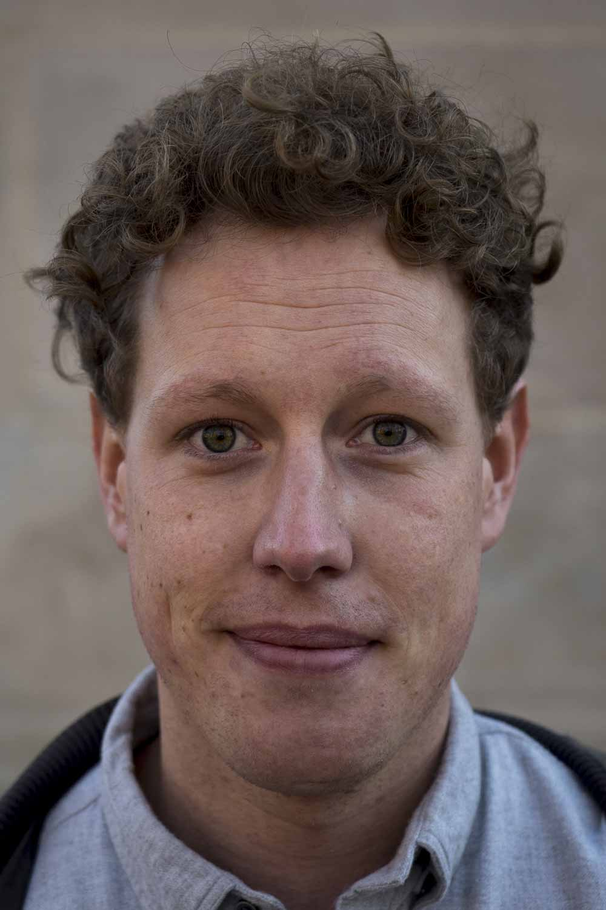

---
#
# By default, content added below the "---" mark will appear in the home page
# between the top bar and the list of recent posts.
# To change the home page layout, edit the _layouts/home.html file.
# See: https://jekyllrb.com/docs/themes/#overriding-theme-defaults
#
layout: home
---

Welcome to my website.

I am a PhD candidate at the Department for Political Science at the University of Zurich. 

I previously spent time as a visiting fellow at Weather Head Center at Harvard University and I hold degrees in International Political Economy from the London School of Economics and in Political Science and Economics from the Free University of Berlin.

My research centers mainly on the political economy of global imbalances, financial fragilites and inequaltiy. In my work study.  On this website you can find information about my Research, my Publications, and my full CV. 
