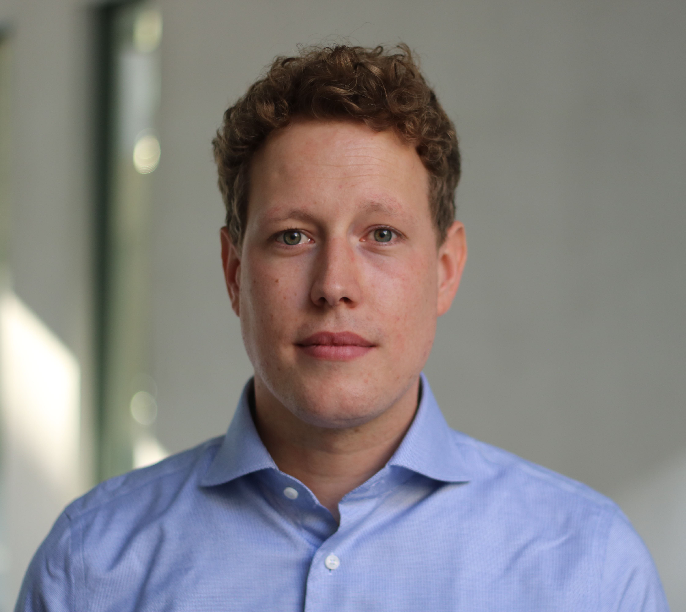

---
#
# By default, content added below the "---" mark will appear in the home page
# between the top bar and the list of recent posts.
# To change the home page layout, edit the _layouts/home.html file.
# See: https://jekyllrb.com/docs/themes/#overriding-theme-defaults
#
layout: home
---

### Welcome!
I am a Policy Fellow working on European economic policy at the [Jacques Delors Centre Berlin](https://www.delorscentre.eu). 

Previously, I did my PhD at the chair for International Relations and Political Economy at the [University of Zurich](https://www.ipz.uzh.ch) and spent time as a visiting fellow at [Weatherhead Center for Internationa Affairs](https://wcfia.harvard.edu) at Harvard University. I hold degrees in International Political Economy from the [London School of Economics](http://www.lse.ac.uk) and in Political Science and Economics from the [Free University of Berlin](https://www.polsoz.fu-berlin.de/en/polwiss/index.html).

My research focuses on International and Comparative Political Economy. I am especially interested in the political causes and consequences of global imbalances, the politics of globalization and structural change and inequaltiy. On this website you can find information about my [research](/research),  my [CV](/cv) and the courses I  [teach](/teaching).
